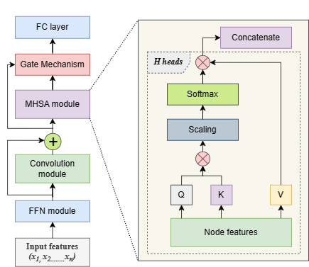
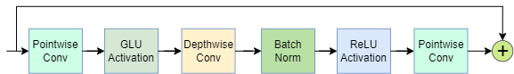

# RL with Convolution-Augmented Attention and Gate Mechanism for Job Shop Scheduling
## Overview
This repository contains the implementation of our Deep Reinforcement Learning (DRL) framework, presented in our paper "A Deep Reinforcement Learning Framework with Convolution-Augmented Attention and Gate Mechanism for Job Shop Scheduling." Our framework leverages a novel combination of convolution-augmented attention and a gating mechanism to solve the Job Shop Scheduling Problem (JSSP), a complex combinatorial optimization problem.

## Features
Convolution-Augmented Attention: Enhances local pattern recognition within the JSSP environment.
Gate Mechanism: Facilitates effective integration of convolution and multi-head self-attention (MHSA) layers.
End-to-End Training: Utilizes a Proximal Policy Optimization (PPO) algorithm within an actor-critic framework for training.
Comprehensive Graph Representations: Captures both local and global dependencies for optimal scheduling.

## Proposed DRL Framework
The following figures depict our proposed Deep Reinforcement Learning model leveraging a convolution-augmented attention mechanism and the convolution module's architecture within the framework. The architectures provide details of how convolution layers and attention modules synergistically process scheduling data. 

Fig 1: Convolution-augmented attention mechanism 

Fig 2: Architecture of Convolution module

## Requirements
Python 3.8      
PyTorch      
Other dependencies listed in requirements.txt

## Installation
git clone https://github.com/goytomdesta     
cd Covolution_Augumented_Attention_Model-for-Job_Shop_Scheduling     
pip install -r requirements.txt

## Usage
python main.py --options     
Replace --options with specific command line arguments for training and evaluation.

## Dataset
Experiments were conducted on Taillard’s benchmark dataset. 

## Contributors
Goytom Gebreyesus, Getu Fellek, Ahmed Farid, Yi Qiang, Shigeru Fujimura, Osamu Yoshie
